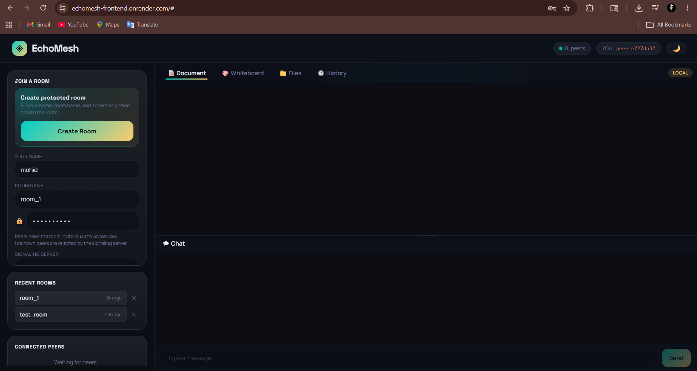
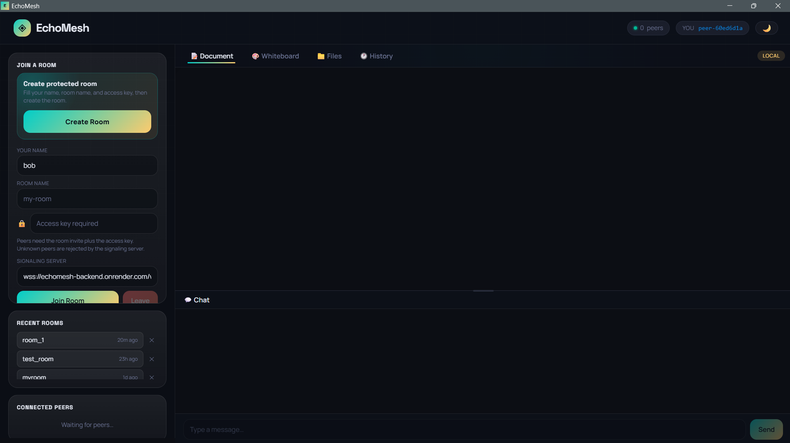
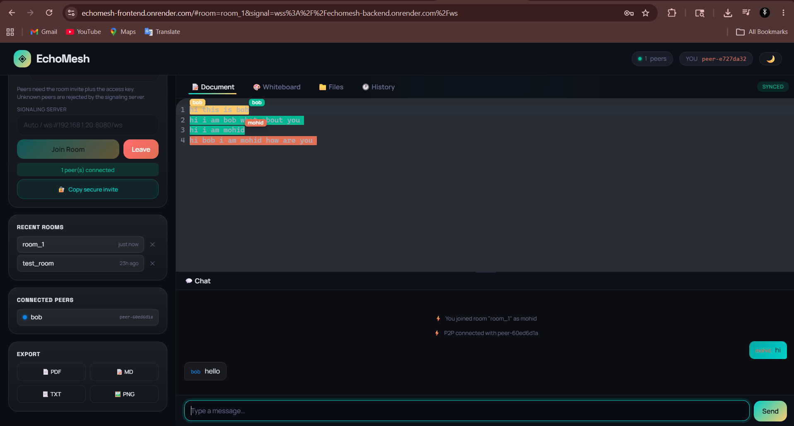

# EchoMesh

EchoMesh is a local-first collaborative workspace for real-time document editing, whiteboarding, chat, room history, exports, and peer-to-peer file sharing. The web and desktop apps use the same frontend and connect through a Rust WebSocket signaling server before syncing data over WebRTC.

## Live Links

- Web app: `https://echomesh-frontend.onrender.com/`
- Signaling server health: `https://echomesh-backend.onrender.com/healthz`
- Desktop releases: `https://github.com/MohammadMohid03/EchoMesh/releases`

## Preview

<!-- Add screenshots here -->

### Web App



### Desktop App



### Collaboration



## Tech Stack

- Rust
- Tokio
- Axum
- WebSockets
- Vite
- TypeScript
- Yjs
- CodeMirror 6
- WebRTC DataChannels
- IndexedDB
- Tauri 2

## Features

- Real-time collaborative markdown editor
- Visual author highlights in the document view
- Shared whiteboard
- Room-based chat and peer presence
- Local document persistence
- Chunked peer-to-peer file sharing
- Export to PDF, Markdown, text, and PNG
- Web app and desktop app support

## Clone

```bash
git clone https://github.com/MohammadMohid03/EchoMesh.git
cd EchoMesh
```

## Run Locally

Start the signaling server:

```bash
cargo run
```

Start the frontend:

```bash
cd frontend
npm install
npm run dev
```

Open:

```text
http://localhost:5173
```

## Run Desktop

```bash
cd frontend
npm install
npm run desktop:dev
```

## Build

Build the web frontend:

```bash
cd frontend
npm run build
```

Build the Rust signaling server:

```bash
cargo build --release
```

Build the desktop app:

```bash
cd frontend
npm run desktop:build
```

## Notes

- The backend is used for signaling only.
- Documents and recent rooms are stored locally per browser or desktop app.
- Web and desktop users can join the same room when they use the same signaling server, room name, and access key.
- WebRTC may require a TURN server on strict networks.
